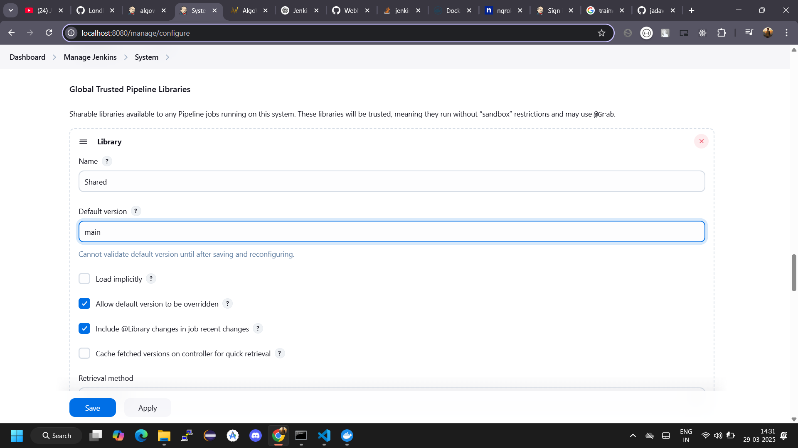
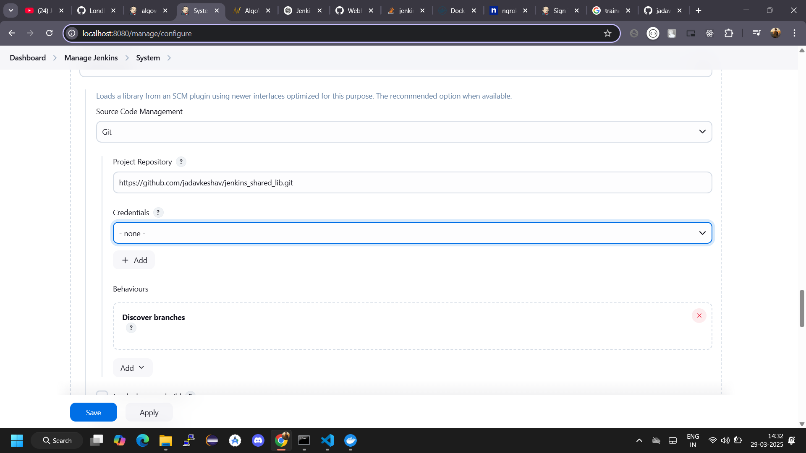
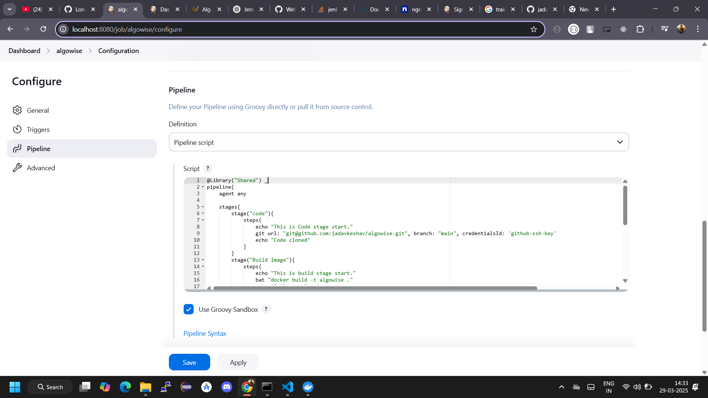

# Jenkins Shared Library
- Shared libraries in Jenkins Pipelines are reusable pieces of code that can be organized into functions and classes.
- These libraries allow you to encapsulate common logic, making it easier to maintain and share across multiple pipelines and projects.
- Shared library must be inside the **vars** directory in your github repository
- Shared library uses **groovy** syntax and file name ends with **.groovy** extension. 

#
## How to create and use shared library in Jenkins.

### How to create Shared library
- Login to your Jenkins dashboard. <a href="">Jenkins Installation</a>
- Go to **Manage Jenkins** --> **System** and search for **Global Trusted Pipeline Libraries**.

  **Name:** Shared  
  **Default version:** \<branch name> 
  **Project repository:** https://github.com/jadavkeshav/jenkins_shared_lib.git  
****

#
### How to use it in Jenkins pipeline
- Go to your declarative pipeline
- Add **@Library('Shared') _** at the very first line of your jenkins pipeline.

**Note:** @Library() _ is the syntax to use shared library.
